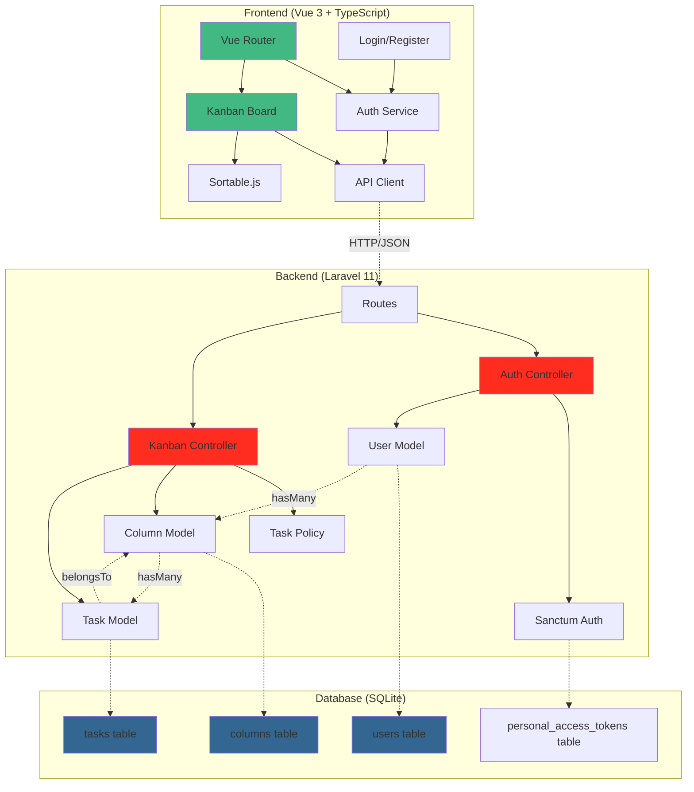

# My Laravel Kanban

A full-stack Kanban board application built with Laravel backend API and Vue 3 interactive frontend. Features user authentication, task management, and drag-and-drop functionality.

## Architecture Overview



## System Architecture

The application follows a clean separation of concerns with:

- **Frontend**: Vue 3 SPA with TypeScript, handling UI interactions and state management
- **Backend**: Laravel 11 REST API with token-based authentication
- **Database**: SQLite for development, easily configurable for production databases
- **Authentication**: Laravel Sanctum for secure API token management

## Features

### Core Functionality
-   ✅ User registration and login (Token authentication)
-   ✅ View kanban columns and tasks
-   ✅ Drag-and-drop tasks between columns and reorder
-   ✅ Create, edit, and delete tasks
-   ✅ Task modal editing interface
-   ✅ Responsive design
-   ✅ Persistent state on page refresh

### Development Tools
-   ✅ Automated CI checks (tests and linting)
-   ✅ Pre-commit hooks for code quality
-   ✅ Hot reload development environment
-   ✅ Full TypeScript support

## Tech Stack

### Backend
-   **Framework**: Laravel 11
-   **Language**: PHP 8.2+
-   **Testing**: Pest (functional testing framework)
-   **Authentication**: Laravel Sanctum (Token-based)
-   **Database**: SQLite
-   **Code Standards**: PHP_CodeSniffer (PSR-12)

### Frontend
-   **Framework**: Vue 3 (Composition API + `<script setup>`)
-   **Language**: TypeScript
-   **Build Tool**: Vite
-   **Testing**: Vitest
-   **Routing**: Vue Router 4
-   **Drag & Drop**: sortablejs-vue3
-   **Code Standards**: ESLint + Prettier

### DevOps
-   **Git Hooks**: Husky
-   **CI/CD**: GitHub Actions
-   **Process Management**: Concurrently

## How to Run

### Prerequisites

-   PHP 8.2+
-   Composer
-   Node.js 20+
-   NPM

### Setup Instructions

1.  **Clone the repository:**
    ```bash
    git clone https://github.com/your-username/my-laravel-kanban-2.git
    cd my-laravel-kanban-2
    ```

2.  **Install root dependencies:**
    ```bash
    npm install
    ```

3.  **Setup Backend:**
    ```bash
    # Move into the backend directory
    cd backend

    # Install Composer dependencies
    composer install

    # Copy the .env.example file
    cp .env.example .env

    # Generate an application key
    php artisan key:generate

    # Run database migrations and seeders
    php artisan migrate --seed

    # Return to the root directory
    cd ..
    ```

4.  **Setup Frontend:**
    ```bash
    # Move into the frontend directory
    cd frontend

    # Install NPM dependencies
    npm install

    # Return to the root directory
    cd ..
    ```

5.  **Run the application:**
    
    This command will start both the Laravel backend server (at `http://127.0.0.1:8000`) and the Vite frontend server (usually at `http://localhost:5173`).
    ```bash
    npm run dev
    ```

    You can now access the application in your browser at the address provided by the Vite server output.

## How to Test

### Quick Test Guide

1. **Register a new user:**
   - Navigate to `http://localhost:5173/register`
   - Fill in name, email, and password
   - Click "Register" - you'll be automatically logged in

2. **Test the Kanban functionality:**
   - You should see 4 columns: "Backlog", "Up Next", "In Progress", "Done"
   - Some sample tasks will be pre-loaded in the "Backlog" column
   - Click on any task to open the edit modal
   - Try dragging tasks between columns
   - Create new tasks using the "+" button in each column

3. **Test authentication:**
   - Click "Logout" in the top right
   - Try accessing `/` - you should be redirected to login
   - Log back in with your credentials
   - Page refresh should maintain your logged-in state

### API Endpoints

The backend provides the following REST API endpoints:

```
POST   /api/register        - User registration
POST   /api/login          - User login
POST   /api/logout         - User logout
GET    /api/user           - Get current user
GET    /api/kanban         - Get all columns with tasks
POST   /api/kanban/tasks   - Create new task
GET    /api/kanban/tasks/{id} - Get specific task
PUT    /api/kanban/tasks/{id} - Update task
DELETE /api/kanban/tasks/{id} - Delete task
PUT    /api/kanban/sync    - Sync column/task order after drag-drop
```

### Running Tests

#### Backend Tests (Pest)
```bash
cd backend
composer test
composer test:coverage  # Run with coverage report
composer lint           # Check code standards
```

#### Frontend Tests (Vitest)
```bash
cd frontend
npm run test
npm run test:watch      # Run in watch mode
npm run test:coverage   # Run with coverage
npm run lint            # Check code standards
npm run lint:fix        # Auto-fix linting issues
```

#### Run All Tests
```bash
# From project root
npm run test:all        # Runs both backend and frontend tests
```

## Available Scripts

### Root Level
-   `npm run dev`: Starts both frontend and backend servers concurrently
-   `npm run test:all`: Runs tests for both backend and frontend
-   `npm run lint:all`: Runs linting for both backend and frontend

### Backend Scripts (run from `/backend`)
-   `composer test`: Run Pest tests
-   `composer test:coverage`: Run tests with coverage report
-   `composer lint`: Run PHP_CodeSniffer
-   `composer lint:fix`: Auto-fix PHP code standards
-   `php artisan serve`: Start Laravel development server

### Frontend Scripts (run from `/frontend`)
-   `npm run dev`: Start Vite development server
-   `npm run build`: Build for production
-   `npm run preview`: Preview production build
-   `npm run test`: Run Vitest tests
-   `npm run test:watch`: Run tests in watch mode
-   `npm run test:coverage`: Run tests with coverage
-   `npm run lint`: Run ESLint
-   `npm run lint:fix`: Auto-fix ESLint issues

## Project Structure

```
my-laravel-kanban-2/
├── backend/                 # Laravel 11 API
│   ├── app/
│   │   ├── Http/
│   │   │   ├── Controllers/
│   │   │   │   └── Api/
│   │   │   │       ├── AuthController.php
│   │   │   │       └── KanbanController.php
│   │   │   └── Middleware/
│   │   ├── Models/
│   │   │   ├── Column.php
│   │   │   ├── Task.php
│   │   │   └── User.php
│   │   └── Policies/
│   │       └── TaskPolicy.php
│   ├── database/
│   │   ├── migrations/
│   │   └── seeders/
│   ├── routes/
│   │   └── api.php
│   └── tests/
├── frontend/                # Vue 3 + TypeScript SPA
│   ├── src/
│   │   ├── components/
│   │   │   ├── KanbanBoard.vue
│   │   │   ├── NewTaskForm.vue
│   │   │   └── TaskModal.vue
│   │   ├── views/
│   │   │   ├── Login.vue
│   │   │   └── Register.vue
│   │   ├── services/
│   │   │   ├── api.ts
│   │   │   └── auth.ts
│   │   ├── router/
│   │   │   └── index.ts
│   │   └── main.ts
│   └── tests/
├── .github/
│   └── workflows/
│       └── ci.yml           # GitHub Actions CI
├── .husky/                  # Git hooks
└── package.json             # Root package for concurrently running dev servers
```

## Development Workflow

### Code Quality
- **Pre-commit hooks** automatically run linting and tests before commits
- **GitHub Actions CI** runs full test suite on push/PR
- **ESLint + Prettier** for frontend code formatting
- **PHP_CodeSniffer** for backend PSR-12 compliance

### Authentication Flow
1. User registers/logs in via frontend forms
2. Laravel Sanctum generates API token
3. Frontend stores token in localStorage
4. All API requests include Bearer token
5. Backend validates token for protected routes

### Task Management Flow
1. Frontend fetches columns and tasks from `/api/kanban`
2. User interactions (create/edit/delete) send API requests
3. Drag-and-drop triggers sync API call with new order
4. Backend updates database and returns success response
5. Frontend updates local state accordingly 